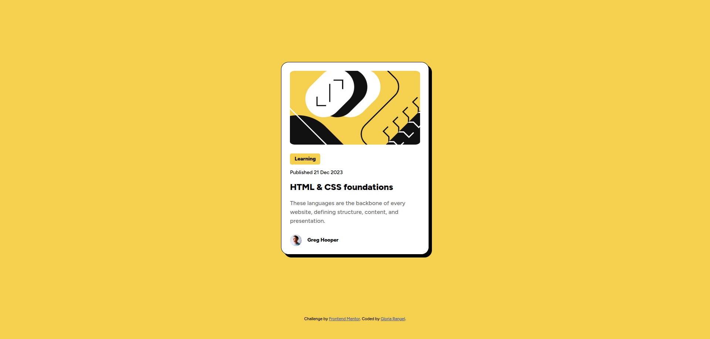
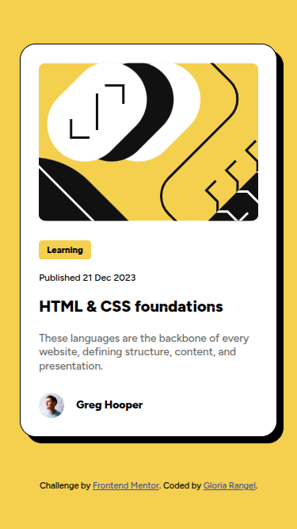
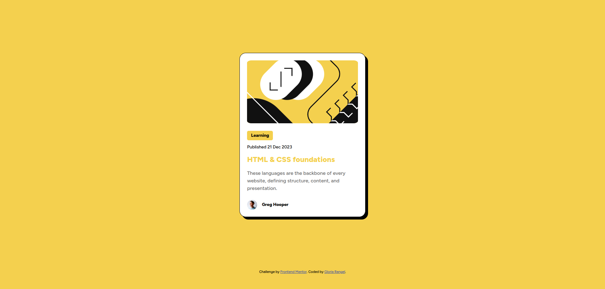

# 🖼 Frontend Mentor - Blog preview card solution

This is a solution to the [Blog preview card challenge on Frontend Mentor](https://www.frontendmentor.io/challenges/blog-preview-card-ckPaj01IcS). Frontend Mentor challenges help you improve your coding skills by building realistic projects. 

## 📋 Table of contents

- Overview
- Screenshot
- Links
- My process
- Built with
- Useful resources
- Author
- Thanks

## 📖 Overview
This project is part of a challenge aimed at strengthening the fundamentals of HTML and CSS. It is ideal for beginners interested in learning and practicing:

-   Creating a semantic HTML structure.
-   Applying the box model in CSS to design interfaces.
-   The design and requirements of the challenge are based on a Figma file, which you can refer to in order to understand how to replicate the provided interface.

### 📸 Screenshot
These are the screenshots of the implemented solution:

- **🖥️ Desktop version**  
  

- **📱 Mobile version**  
  

- **👆 Hover**  
  

### ⛓️ Links

- HTML URL: [index.html](https://github.com/NorimNori/blog-preview-card/blob/main/index.html)
- CSS URL: [styles.css](https://github.com/NorimNori/blog-preview-card/blob/main/styles.css)
- Live Site URL: [on Netlify](https://blog-preview-card-by-gr.netlify.app/)

## 📌 My process

### 🪚 Built with

- Semantic HTML5 markup
- CSS custom properties
- Flexbox
- CSS Grid
- Mobile-first workflow
- Google fonts

### 🔬 What I learned

By working on this project, I enhanced my ability to pay close attention to design details, such as spacing, alignment, and typography, ensuring the implementation closely matches the provided reference. This challenge also allowed me to refine my understanding of essential front-end concepts, like the box model and semantic HTML structure, further solidifying my foundation in web development.

## 👋 Author

- LinkedIn - [Gloria Rangel](https://www.linkedin.com/in/gloria-rangel-06b960306/)
- Frontend Mentor - [@NorimNori](https://www.frontendmentor.io/profile/NorimNori)

## 🌟 Thank You 🌟
Thanks for visiting this repository! I hope you found it useful and inspiring, or it was just a fun time.  

A special thanks to [Frontend Mentor](https://www.frontendmentor.io) for the challenge and for being such an amazing platform to learn and grow as a developer.  

Have a nice day! 😊
